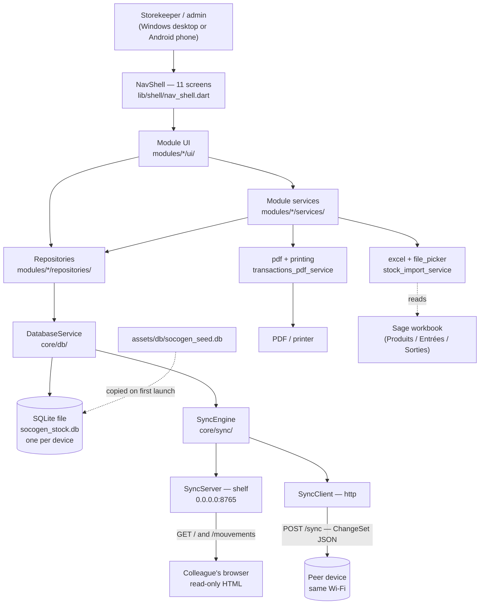

# ARCHITECTURE — SM (dépôt `socogen`)

Reference document for the SM stock-management application. It describes
what is in the repository today, read from the code rather than from
intent. Domain rules and the reasoning behind them live in
[`CLAUDE.md`](CLAUDE.md); this document describes the *shape* of the
system.

**The product is named SM; the repository, the Dart package, the Android
`applicationId` and the database file are still `socogen`.** That is
deliberate — those four are identity, not branding. See §10.

---

## 1. PROJECT STRUCTURE

A single Flutter application plus a small Python toolchain. There is no
server, no service tier and no container: the whole product is one
process on one device, with a SQLite file beside it.

```
socogen_v2/
├── flutter_app/              THE APPLICATION — Flutter, ships to Windows / Android / iOS
│   ├── lib/                  Dart source, arranged by domain (see below)
│   ├── test/                 34 test files, 251 declared test cases
│   ├── assets/
│   │   ├── db/socogen_seed.db    pre-built empty database copied on first launch (schema v1)
│   │   └── logo.png              source image for flutter_launcher_icons
│   ├── android/              Android runner — namespace/applicationId com.shemab.socogen
│   ├── ios/                  iOS runner
│   ├── windows/              Windows C++ runner
│   ├── installer.iss         Inno Setup script → SM_Setup.exe
│   ├── pubspec.yaml          Dart package manifest (name: socogen)
│   └── analysis_options.yaml flutter_lints ruleset
├── scripts/                  Python tooling (not part of the shipped app)
│   ├── schema.sql            canonical clean schema, source for the seed database
│   ├── build_clean_seed_db.py  builds assets/db/socogen_seed.db from schema.sql
│   └── gcm_to_excel.py       reads Sage Gestion Commerciale .gcm binaries → Excel
├── .claude/skills/run-socogen/   agent skill: build, launch and drive the Windows app
│   ├── SKILL.md
│   ├── drive.ps1             launch / capture / click / type against a running window
│   └── sandbox.py            throwaway copy of the build output, so driving never
│                             writes into the developer's real database
├── dev_data/                 developer's working database (gitignored)
├── CLAUDE.md                 development guide: invariants, build traps, domain rules
├── README.md                 user-facing overview (French)
├── requirements.txt          Python deps for scripts/ only (openpyxl)
└── produits.xlsx             sample Sage export used during import work
```

### `flutter_app/lib/` — arranged by domain, not by technique

```
lib/
├── main.dart                 entry point: runApp(StockApp) + splash gate
├── app.dart                  AuthGate — routes loading → login → first-run setup → shell
├── core/                     no business logic; imports no module
│   ├── db/                   DatabaseService, AppSchema, sync columns, factory init
│   ├── auth/                 AuthProvider, PBKDF2 hasher, PermissionGate, login UI
│   ├── sync/                 SyncServer, SyncClient, SyncEngine, ChangeSet models
│   ├── money/                Montant / Devise / Taux — integer money
│   ├── errors/               messagePour(), ErreurUtilisateur
│   ├── events/               DataRefreshBus
│   └── utils/                formatters, app restart
├── modules/                  one folder per domain, each models/ repositories/ services/ ui/
│   ├── catalogue/            products, familles, prices
│   ├── stock/                stores, entries, outputs, transactions, inventory
│   ├── tiers/                clients and fournisseurs
│   ├── rapports/             dashboard, reports, PDF, read-only web pages
│   ├── utilisateurs/         accounts and roles
│   └── parametres/           company settings, VAT rates, first-run setup
├── shared/                   design system + vocabulary exchanged between modules
│   ├── models/               view_models.dart (StockStatus), tiers.dart, taux_tva.dart
│   └── ui/theme|widgets/     AppTheme, breakpoints, AdaptiveTable, KpiCard, …
└── shell/nav_shell.dart      composition root — the only place allowed to know every module
```

**The boundary rule is executable.** A module reaches another module only
through its `services/` folder, never its `models/` or `repositories/`;
`core/` and `shared/` import no module at all; `shell/` is exempt because
assembling modules is its job. Dart cannot enforce this, so
`test/architecture_test.dart` reads every `package:socogen/…` import and
fails on a violation. Its `_detteConnue` set (currently 20 entries) freezes
inherited breaches: the list can only shrink, and an entry that is no
longer needed fails the test just as a new breach does.

---

## 2. HIGH-LEVEL SYSTEM DIAGRAM

There is no backend. Everything below runs inside one Flutter process.



**Request flow, in words.** A screen calls a repository (or a service that
calls repositories); the repository issues SQL against the one
`Database` handle owned by `DatabaseService`; results come back as
models. Nothing crosses a network unless the operator explicitly starts a
Wi-Fi sync from the Sécurité screen. The only two network surfaces are
`SyncServer` (opened by hand, closed by hand) and `SyncClient` (a single
POST per sync).

---

## 3. CORE COMPONENTS

### 3.1 The Flutter application (`flutter_app/`)

| | |
|---|---|
| **Purpose** | The entire product — catalogue, stock movements, inventory, reports, users, settings |
| **Technologies** | Flutter, Dart SDK `^3.12.1`, Material; `provider` 6.1 for state, `sqflite` 2.4 + `sqflite_common_ffi` 2.4 for storage |
| **Entry points** | `lib/main.dart` (`runApp`, splash + database boot) → `lib/app.dart` (`AuthGate`) → `lib/shell/nav_shell.dart` (`NavShell`) |
| **Deployment** | Windows: Inno Setup installer. Android: APK. iOS: runner present, not in the release path. |

`main.dart` opens the database *before* showing anything else — the
single-process equivalent of waiting for a backend to come up — and shows
the failure on the splash screen if it cannot.

`AuthGate` then routes on `AuthProvider.status`: `unknown` → booting,
`setupRequired`/`loggedOut` → `LoginScreen`, `loggedIn` → first-run
`CompanySetupScreen` if `sync_meta.company_configured` is unset, otherwise
`NavShell`.

`NavShell` holds eleven screens in an `IndexedStack` and picks its
navigation surface from the window size class: bottom bar (compact),
rail (medium), sidebar (expanded/large). The last two entries — Sécurité
and Paramètres — are admin-only and are sliced off the list for a
`magasinier`. Screens, in order: Tableau de bord, Produits, Entrées,
Sorties, Transactions, Inventaire, Rapports, Tiers, Magasins, Sécurité,
Paramètres.

### 3.2 Layering inside a module

```
ui/            screens and dialogs; ask PermissionGate, call services and repositories
services/      the only surface another module may import; domain operations
repositories/  SQL; one class per table or per read model
models/        plain Dart data classes
```

Services present today: `CatalogueService`, `StockService`,
`InventoryService`, `StockImportService`, `TiersService`,
`ParametresService`, `TransactionsPdfService`, `WebReportPages`.
Repositories: `ProductRepository`, `FamilleRepository`, `StockRepository`,
`StockEntryRepository`, `StockOutputRepository`, `StoreRepository`,
`TransactionRepository`, `TiersRepository`, `ReportRepository`,
`UserRepository`, `SettingsRepository`, `TvaRepository`.

### 3.3 `core/` — the kernel

- **`core/db`** — `DatabaseService` is a singleton owning the one
  `Database`. It resolves the per-platform path, copies the seed asset on
  first launch, sets `PRAGMA foreign_keys = ON`, and runs the migration
  chain. `AppSchema` holds the create statements, the per-version
  migrations, the index list and the default VAT rates.
- **`core/money`** — money is an integer count of minor units plus a
  `Devise`, never a `double`. The franc CFA has no subdivision
  (`Devise.xaf`, exponent 0). Rates are in ten-thousandths because
  Cameroonian VAT is 19.25 % (`Taux.tvaCameroun` = 1925). `horsTaxe()`
  divides by 1.1925 — subtracting 19.25 % from a TTC figure does not
  return the HT one.
- **`core/errors`** — `messagePour()` turns a technical error into an
  actionable French sentence; no exception text reaches a screen.
  `ErreurUtilisateur` lets a service raise an already-worded business
  cause.
- **`core/auth`** — `AuthProvider` (a `ChangeNotifier`) holds session
  status; `password_hasher.dart` is PBKDF2-HMAC-SHA256 at 12 000
  iterations, written on `crypto` with no added dependency; legacy
  single-round SHA-256 digests stay verifiable and are rewritten on the
  next successful login. `PermissionGate` answers rights questions — see
  §7.
- **`core/sync`** — see §3.4.
- **`core/events`** — `DataRefreshBus`, how a completed sync or import
  tells open screens to reload.

### 3.4 Wi-Fi synchronisation (`core/sync/`)

Two devices of the same business exchange changes directly over the local
network; there is no server in the middle.

- **`SyncServer`** (`shelf`, `shelf_io`) binds `0.0.0.0:8765`, started and
  stopped by hand from the Sécurité screen. It serves `POST /sync` —
  merge the caller's `ChangeSet`, reply with this device's own — and two
  read-only HTML pages, `/` and `/mouvements`, so a colleague on the same
  Wi-Fi can read stock from a browser. Those are GET-only on purpose: a
  shared link can never change anything.
- **`SyncClient`** (`http`) posts the local `ChangeSet` to a peer and
  applies the reply. A 20 s timeout; a `409` means `TenantMismatch`.
- **`SyncEngine`** collects and applies changes. Merge keys: `stores` by
  `name`, `products` by `reference`, `product_stocks` by
  `(reference, store name)`, movements by a generated `sync_id`. Last
  `updated_at` wins. Deletions travel as `sync_tombstones` rows.
- **Tenancy.** `sync_meta.tenant_id` is minted on *first sync*, not at
  creation — stamping at creation would give two devices of one business
  different ids forever. `reconcileTenant` runs before any row is merged:
  an unclaimed database adopts the peer's claim, a claim is never
  reassigned, two different claims raise `TenantMismatch`. The check must
  come first, because the merge runs on natural keys: two businesses each
  keeping a "Dépôt" and a "RIZ25" would not fail to merge, they would
  fuse.

### 3.5 Python tooling (`scripts/`)

Not shipped and not imported by the app. `build_clean_seed_db.py` builds
`assets/db/socogen_seed.db` from `schema.sql` with no accounts, no
magasins and a blank company name. `gcm_to_excel.py` reads Sage's binary
`.gcm` and extracts the article catalogue — per-depot stock and movement
dates could not be decoded with confidence and are left blank rather than
invented. Sage stores text in **Mac Roman**, not Latin-1.

---

## 4. DATA STORES

One SQLite file per device, owned by `DatabaseService`. No server
database, no cache, no queue.

| Platform | Location |
|---|---|
| Windows | beside the executable (`socogen_stock.db`) |
| Android / iOS | app documents directory (`app_flutter/socogen_stock.db`) |
| Linux / macOS | application support directory |

**Schema version 5** (`AppSchema.version`). The shipped seed asset is
still **v1** and carries no indexes, so a fresh install runs the migration
chain too — a schema change needs an `onUpgrade` step, not only an
`onCreate` one.

### Tables

| Table | Holds | Notes |
|---|---|---|
| `products` | article catalogue | `reference` UNIQUE — the real key; `prix_achat`/`prix_vente` are nullable integers (unknown ≠ free) |
| `familles` | product families, self-referencing tree | `parent_id` → `familles(id)` |
| `taux_tva` | VAT rates | `pour_dix_mille`; ships NORMAL 1925 and EXONERE 0 |
| `stores` | magasins | `name` UNIQUE — also the sync merge key |
| `product_stocks` | **opening** stock per (product, store) | `initial_stock` is the opening figure, never the current one |
| `stock_entries` | receipts | `reference` + `store_id` + `quantity`, free-text `supplier`, optional `tiers_id`, `sync_id` |
| `stock_outputs` | issues | as above plus `invoice_number` and `destination` |
| `tiers` | clients and fournisseurs | `code` and `nom` both UNIQUE; `type` ∈ client / fournisseur / les_deux |
| `users` | accounts | `username` UNIQUE, `password_hash` + `password_salt`, `role` ∈ admin / magasinier |
| `company_settings` | the customer's own identity | single row, `id = 1`; blank on a fresh database |
| `sync_meta` | key/value, device-local | `tenant_id`, `last_sync_at`, `company_configured`; never part of a `ChangeSet` |
| `sync_tombstones` | propagated deletions | `table_name`, `merge_key`, `deleted_at` |

### Invariants the schema does not state

- **Movements find their product by `reference`, a string — not by a
  foreign key.** Deleting a product deliberately leaves its movements
  standing. Most of the surprising SQL here follows from this.
- **Current stock is derived, never stored:**
  `initial_stock + entrées − sorties`.
- **A balance belongs to a product, not to a filter.** Date, type and
  search choose which rows are *shown* and never enter the running
  balance.
- **A movement keeps its typed text.** `supplier` / `destination` stay
  even after the `tiers` fiche is renamed or merged; the link follows the
  name, and is re-resolved on edit only when the text changed.

### Migrations (`DatabaseService.migrer`)

| Step | Adds |
|---|---|
| → v2 | `updated_at` / `sync_id` columns, `sync_meta`, `sync_tombstones`; backfills existing rows in one batch |
| → v4 | `familles`, `taux_tva`, prices, barcode, `actif`, `devise` |
| → v5 | `tiers`, `tiers_id` on both movement tables, plus a replayable reprise that creates fiches from existing free text and links them by **exact string equality** |

**The index pass runs once, after the whole chain — never inside a step.**
`createIndexStatements` is the list for the *current* schema; a step that
reapplied it built today's indexes on its own era's tables (`_migrateToV4`
on a v3 database reached for an index on `tiers`, which only v5 creates)
and the app could not open its database at all. `migrer` is public and
static so `test/core/migration_v4_test.dart` can run it in its real order.

Eleven indexes exist, all on the movement/lookup paths. They matter: the
stock report once ran two correlated subqueries per (product × store) and
took ~3 s on 400 products; joining pre-aggregated totals brought the same
report to 63 ms.

---

## 5. EXTERNAL INTEGRATIONS

No third-party API, no SaaS, no telemetry, no analytics, no cloud account.
Nothing in the codebase holds a key or a remote endpoint. What is external
is local:

| Integration | Purpose | Method |
|---|---|---|
| **Peer device** | Wi-Fi sync between two installations | `POST http://<peer>:8765/sync`, JSON `ChangeSet`, via `http` / `shelf` |
| **Browser on the LAN** | read-only stock and movement pages | `GET /` and `/mouvements` served by `SyncServer` |
| **Sage Gestion Commerciale** | initial data takeover | offline — an Excel export read by `StockImportService`, or a `.gcm` file read by `scripts/gcm_to_excel.py` |
| **System printer / PDF viewer** | Transactions and Rapports output | `pdf` 3.12 + `printing` 5.14 |
| **File system** | picking a workbook or a database to import | `file_picker` 11.0 |

### Dart dependencies (`pubspec.yaml`)

`provider` ^6.1.5 · `sqflite` ^2.4.3 · `sqflite_common_ffi` ^2.4.1 ·
`path_provider` ^2.1.5 · `path` ^1.9.1 · `pdf` ^3.12.0 · `printing` ^5.14.3 ·
`excel` ^4.0.6 · `file_picker` ^11.0.2 · `crypto` ^3.0.7 · `intl` ^0.20.2 ·
`shelf` ^1.4.2 · `http` ^1.2.0 · `uuid` ^4.5.1 · `cupertino_icons` ^1.0.8.
Dev: `flutter_test`, `flutter_lints` ^6.0.0, `flutter_launcher_icons` ^0.14.3.

Python: `openpyxl>=3.0.10`, for `scripts/` only.

---

## 6. DEPLOYMENT & INFRASTRUCTURE

**There is no cloud provider, no container, no CI pipeline.** No
`Dockerfile`, no `docker-compose`, no `.github/workflows`, no
`Jenkinsfile` exists in the repository. The product is an installer handed
to a business, and an APK.

### Windows

```bash
cd flutter_app && flutter build windows --release
ISCC.exe "/O<temp-dir>" installer.iss     # compile OUTSIDE the project folder
# then copy SM_Setup.exe into flutter_app/dist/
```

`installer.iss`: Inno Setup, French only, `PrivilegesRequired=lowest`,
installs to `{autopf}\SHEMAB\SM`. `AppId`
`{B3A7C2D4-1F5E-4A8B-9C6D-2E0F3A4B5C6D}` is identity — Inno upgrades in
place only while it matches, so renaming the product must never change it.
An `[InstallDelete]` block sweeps up the artefacts of installs made under
the old SOCOGEN name. `native_assets.json` is marked
`skipifsourcedoesntexist` because some Flutter versions emit it and others
do not.

### Android

`com.shemab.socogen`, label `SM`, `compileSdk`/`minSdk`/`targetSdk`
inherited from the Flutter toolchain. Permissions: `INTERNET` and
`ACCESS_NETWORK_STATE`, with `usesCleartextTraffic="true"` — the Wi-Fi
sync and the read-only pages are plain HTTP on the LAN. Icons are
generated by `flutter_launcher_icons` from `assets/logo.png`.

```bash
cd flutter_app && flutter build apk --release
```

`file_picker` needs its AGP9 pub-cache patch for the Android build.

### iOS

A runner exists and the app is written to ship there, but nothing in the
repository automates an iOS release.

### Build traps that cost an afternoon each

- **`flutter build windows` exits 0 when it fails.** Read the output text,
  not the exit code. `ISCC` piped through `tail` does the same.
- **The Windows installer must be compiled outside the project folder** —
  output written in place trips real-time antivirus scanning and dies with
  `EndUpdateResource failed (110)`.
- **`SM.exe` keeping an old timestamp after a release build is normal.**
  It is the C++ runner shell, relinked only when the runner sources
  change; the Dart code is
  `build/windows/x64/runner/Release/data/app.so`.
- **`build/windows/x64/runner/Debug/socogen_stock.db` is real working
  data**, not build junk — the Windows database lives beside the
  executable, and `flutter clean` destroys it. That is why
  `.claude/skills/run-socogen/sandbox.py` exists.

### Monitoring and logging

None. No logging framework, no crash reporter, no metrics. A failure is
what the storekeeper sees on screen, phrased by `messagePour()`.

---

## 7. SECURITY CONSIDERATIONS

**State the limit first: this is a local application with no server, and
that bounds everything below.** A permission hides a screen and refuses a
button; it does not protect the SQLite file, which anyone with the device
can open. `core/auth/permissions.dart` says so in its own header, so that
nobody relies on the gate for more than it does.

- **Authentication** — username and password against the local `users`
  table. PBKDF2-HMAC-SHA256, 12 000 iterations, per-user salt, iteration
  count recorded inside each digest so it can be raised without
  invalidating what exists. Legacy single-round SHA-256 digests remain
  verifiable and are rewritten at the next successful login — the only
  moment the cleartext password exists. No session persistence: every
  launch lands on the login screen.
- **Authorization** — two hard-coded roles, `admin` and `magasinier`.
  `PermissionGate.autorise()` is the single decision point; `Permissions`
  declares six named rights (`utilisateurs.gerer`, `parametres.modifier`,
  `stock.consulter`, `stock.saisir`, `catalogue.gerer`,
  `rapports.consulter`), two of them `adminSeul`. The gate exists ahead of
  real role data on purpose: screens call it from day one, and the planned
  per-role permission table replaces the rule that answers without
  touching a single caller. `NavShell` also slices the admin-only screens
  out of the navigation list.
- **Tenancy** — `SyncEngine.reconcileTenant` refuses to merge two
  databases claimed by different businesses, and refuses *before* any row
  is applied. Checked on both sides, because the peer may be an older
  build with no check at all.
- **Transport** — plain HTTP on the LAN, `usesCleartextTraffic="true"` on
  Android. No TLS, no authentication on `POST /sync`: anything that can
  reach port 8765 and presents a matching (or absent) tenant claim can
  exchange data. The server is off unless an admin starts it. The HTML
  pages are GET-only so a shared link cannot write.
- **At rest** — none. The SQLite file is unencrypted.
- **Input handling** — repositories use parameterised `sqflite` calls;
  `WebReportPages.esc()` escapes values interpolated into the served HTML.

---

## 8. DEVELOPMENT & TESTING

### Prerequisites

Flutter with Windows desktop support and the Visual Studio C++ toolchain
(the Windows runner is compiled with MSBuild/`cl.exe`). Dart SDK
`^3.12.1`. Python 3 for `scripts/` and for the run skill's `sandbox.py`
(stdlib only; the repo's `.venv` works).

### Run and build

```bash
cd flutter_app
flutter pub get
flutter run -d windows          # or -d <android device>
flutter build windows --release
flutter build apk --release
```

Python tooling, from the repository root:

```bash
.venv/Scripts/python.exe scripts/build_clean_seed_db.py   # → flutter_app/assets/db/socogen_seed.db
.venv/Scripts/python.exe scripts/gcm_to_excel.py <file.gcm>
```

### Verification

```bash
cd flutter_app
flutter analyze                 # the project's only typechecker; keep it at zero
flutter test
```

`flutter_lints` ^6.0.0 via `analysis_options.yaml` is the whole code-quality
toolchain — there is no separate formatter config, no SonarQube, no
pre-commit hook.

### The test suite

**34 test files, 251 declared test cases** across 64 groups, covering
repositories, services, migrations, money, permissions, responsive layout
and the module boundaries themselves.

| File | Pins |
|---|---|
| `architecture_test.dart` | module boundaries, and that `_detteConnue` only shrinks |
| `core/migration_v4_test.dart` | the migration chain in its real order, including the index pass |
| `core/montant_test.dart` | integer money, HT/TTC, half-away-from-zero rounding |
| `core/password_hasher_test.dart` | PBKDF2 round-trip and legacy-digest upgrade |
| `services/sync_engine_test.dart`, `services/sync_tenant_test.dart` | merge behaviour; tenant claim, adoption and refusal |
| `services/inventory_service_test.dart` | a settled article leaves the Rapports anomaly list |
| `repositories/mouvement_tiers_test.dart` | the link follows the name, and an edit does not undo a merge |
| `repositories/negative_stock_test.dart` | warnings on all three write paths |
| `android_transaction_card_test.dart` | a ceiling on card height, which one added field pushes through |

Things worth knowing before writing a test here:

- Repository tests share `test/repositories/test_database.dart`; its
  header documents every expected aggregate.
- Screen tests pump a **fixed budget**, not `pumpAndSettle` — skeleton
  placeholders animate on an endless repeat and settling never completes.
  A screen whose data arrives after that budget is asserted against its
  skeleton and passes vacuously.
- **Two in-memory databases are the same database** unless the open
  options say `singleInstance: false`; without it a two-device sync test
  quietly becomes one device syncing with itself.
- Platform-conditional UI uses `debugDefaultTargetPlatformOverride`, reset
  **inside** the test body.
- `web_report_test.dart` binds port 8765 and fails while any build is
  running with its sync server on.
- **sqflite differs by platform and the desktop will not catch it.**
  Android's `SQLiteDatabase.execSQL` rejects any statement that returns
  rows, so `PRAGMA journal_mode = WAL` must go through `rawQuery`. The
  desktop FFI backend runs it happily — this class of bug ships looking
  fine after a full desktop test pass.

### Driving the real app

`.claude/skills/run-socogen/` builds a debug Windows build, copies it to a
sandbox with a throwaway `verif` / `verif1234` admin, and drives it
(`launch`, `capture`, `click`, `keys`) so a change can be verified in the
running app rather than only in tests. Never drive the build output in
place: the database lives beside the executable.

---

## 9. FUTURE CONSIDERATIONS

The codebase carries no `TODO` or `FIXME` markers. The gaps are named
deliberately in `CLAUDE.md` instead — close them when the work touches
that area, and do not make any of them worse.

### Known gaps, in the order they hurt

1. **A movement has no author.** There are users and roles, but
   `stock_entries` and `stock_outputs` record nobody. In a stock ledger,
   who entered a line and when is not a nicety. Any schema change in that
   area should add attribution. The physical inventory has the same gap:
   no author, no session record.
2. **History is edited in place.** Transactions lets a past movement be
   changed or deleted outright. Accounting practice is a corrective
   movement that leaves the original standing — the shape `InventoryService`
   already uses, and the one new work should prefer.
3. **Negative stock is flagged, not prevented.** 21 of the 400 live
   articles carry a negative balance. `StockStatus.stockNegatif` is a state
   of its own, Rapports raises a banner and filters to those rows, and all
   three write paths warn before creating one. The policy is
   warn-and-record on purpose: goods that have physically left must still
   be recordable. The cure is the physical inventory.
4. **There is no valuation.** Prices now exist on the article
   (`prix_achat` / `prix_vente`, nullable), but there is no stock value, no
   CUMP, no FIFO — nothing an accountant can use.
5. **Stock thresholds are global.** `StockStatus.fromCurrent` calls
   anything under 10 "stock faible", whether it is rice by the tonne or a
   carton of matches. These belong per article.
6. **A transfer between magasins is not a concept.** It is a sortie in one
   store and an entrée in the other with nothing linking them, so goods in
   transit read as a loss here and a windfall there.
7. **Units are free text.** `unit` has no conversions, so CARTON and PIÈCE
   sit in the same column and cannot be totalled.

### Planned work

The phased plan is recorded in `CLAUDE.md` rather than a task file.
**Phase 4 replaces `PermissionGate`'s hard-coded rule with a per-role
permission table**, without touching callers — the decision point was
built early precisely so that change stays local. The application is
stated to be evolving toward a full gestion commerciale system: catalogue,
tiers, ventes, POS, achats, comptabilité. Catalogue and tiers have landed;
the `modules/` layout exists because a `data/` + `screens/` split stopped
saying anything past the first domain.

### Technical debt with a named list

`test/architecture_test.dart:_detteConnue` holds 20 frozen boundary
breaches inherited from the previous layout. Each phase that creates the
missing service removes the corresponding lines. The list can only shrink.

### Open branches

`feat/sage-import`, `fix/table-scrollbar-drag`, and a worktree on
`agents/feature-implementation-assistance` at
`../socogen_v2.worktrees/feature-implementation-assistance`.

---

## 10. GLOSSARY

Project vocabulary, as the code uses it. The interface is in French and
stays that way — the people using this are storekeepers, not developers.

| Term | What it means here |
|---|---|
| **SM** | The product name (`AppBranding.productName`). The repository, Dart package, database filename and Android `applicationId` stay `socogen` — those are identity, not branding, and renaming them would read as a fresh empty install or break in-place upgrades. |
| **SOCOGEN** | The first customer (SHEMAB, Yaoundé): ~400 articles, three magasins, a few thousand movements a year, taken over from Sage. The app was named after it until a second business could install it. |
| **Magasin** | A store / warehouse (`stores`). Matched across devices by `name`. |
| **Entrée** | A receipt into a magasin (`stock_entries`). |
| **Sortie** | An issue out of a magasin (`stock_outputs`). |
| **Mouvement** | Either of the above; what Transactions lists. |
| **Tiers** | A client or fournisseur fiche (`tiers`). One fiche can be both (`les_deux`) — a wholesaler sometimes buys from whoever it sells to. |
| **Fiche** | A record in `tiers`. A fiche with history behind it is never deleted; `TiersRepository.fusionner` merges and deactivates instead. |
| **Reprise** | A data takeover that runs inside a migration — creating fiches from text already typed, and linking movements to them. Written to be replayable. |
| **Stock initial / d'ouverture** | `product_stocks.initial_stock` — the **opening** figure, not today's. Feeding it a current stock and then importing the movements counts them twice. |
| **Stock actuel** | Derived, never stored: `initial_stock + entrées − sorties`. |
| **Stock après** | The running balance shown per movement in Transactions. A fact about the movement, scoped to the selected magasin; filters never enter it. |
| **Inventaire physique** | Counting the shelf and posting the difference as a corrective movement. The counterparty text is `InventoryService.label`, "Inventaire physique". A count session is a draft; an article absent from it is **not counted, never assumed zero**. |
| **Rupture / stock faible / stock négatif** | `StockStatus` — zero / under 10 / below zero. The last is a state of its own so a negative cannot hide among the hundreds of articles legitimately at zero. |
| **Famille** | A product family, a self-referencing tree (`familles`). |
| **Taux / pour dix mille** | A rate in ten-thousandths. Cameroonian VAT is 19.25 % = `1925` (17.5 % plus 1.75 % centimes additionnels communaux). |
| **Montant / Devise** | Integer minor units plus a currency. `XAF` (FCFA) has exponent 0 — the franc CFA has no subdivision. |
| **HT / TTC** | Hors taxe / toutes taxes comprises. `horsTaxe()` divides by 1.1925; subtracting 19.25 % from a TTC figure does not give the HT one. |
| **Magasinier** | The non-admin role. Sees every screen except Sécurité and Paramètres. |
| **Tenant** | The business a database belongs to (`sync_meta.tenant_id`), minted on first sync and never reassigned. |
| **ChangeSet** | Everything that changed on a device since a timestamp, exchanged verbatim in both directions during a sync. |
| **Tombstone** | A deletion propagated to a peer (`sync_tombstones`), identified by the same merge key the row was matched on. |
| **`.gcm`** | Sage Gestion Commerciale's binary file. Text inside is **Mac Roman**, not Latin-1 — an ASCII-only scan silently drops every article with an accent or a `°`. |
| **`_detteConnue`** | The frozen list of module-boundary breaches in `architecture_test.dart`. It can only shrink. |

---

## 11. PROJECT IDENTIFICATION

| | |
|---|---|
| **Project name** | SM — Gestion de Stock (repository, package and database: `socogen`) |
| **Repository** | https://github.com/erniotario/SOCOGEN.git |
| **Default branch** | `main` (at `787dccb`) |
| **Publisher** | SHEMAB, Yaoundé, Cameroun (`installer.iss` → `AppPublisher`) |
| **First customer** | SOCOGEN — ~400 articles, three magasins (Hysacam, Ekie, Elig-Essono) |
| **Version** | `1.0.0+1` (`pubspec.yaml`), `1.0.0` (`installer.iss`) |
| **Schema version** | 5 (`AppSchema.version`); seed asset ships at v1 |
| **Interface language** | French |
| **Date of last update** | 2026-09-20 |

### Where to go next

- [`CLAUDE.md`](CLAUDE.md) — the development guide: invariants, build
  traps, domain rules, and the reasoning behind each. The authority on
  *why*; this document describes *what*.
- [`README.md`](README.md) — user-facing overview, in French.
- [`.claude/skills/run-socogen/SKILL.md`](.claude/skills/run-socogen/SKILL.md)
  — how to build, launch and drive the real Windows app.
